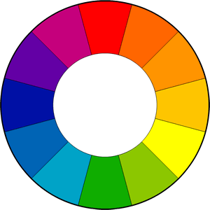

# Guidelines for Web Design

## Typography

### Font Size

- Use 15-25px for body text
- If using larger font sizes for headers, etc., you can reduce the font weight so it doesn't take up too much visual real estate on the page

### Spacing

- Use line spacing of 120-150% (another opinion: 1.6 ratio is a good place to start, so for example 12px font with 19.2px spacing or 14px font with 22.4px spacing)
- 45-90 characters per line (another opinion says 45-75)
- Letter spacing: large headlines can look better with less spacing, while text can look better by adding some spacing

### Justification

- Don't use justified font. Stick to left-aligned as it's easier to read

### Font Families

- Sans-serif is best for most things
  - Open Sans
  - Lato
  - Raleway
  - Monsterrat
  - PT Sans
- Serif is for storytelling or long reading
  - Cardo
  - Merriweather
  - PT Serif
- Choose a font that reflects the look and feel you want for the website
- Decide on serif or sans-serif
- Use only one typeface (unless you're more experienced) OR use 2 typefaces (one for headings and another for content) and then use bold, italics, uppercase, etc. to style them

## Color

- Use only one base color (anything other than black, white, shade of gray) then you can use something like http://0to255.com to get lighter & darker shades of that color to use as accents, hover states, etc.
- Can use the main or a complementary 2nd color for things like a call-to-action button or anythign else that needs attention drawn to it
- Another opinion: choose 2 to 4 colors and use only those
- Another opinion: use a maximum of 3 primary colors; if additional colors desired, make use of shades and tints
- Use a color to draw attention; a color that stands out will draw attention to things on the page
- Never use black in a design (even in fonts) - it almost never appears in the real world
- If using shadows or gradients, put lighter colors on top to make it appear as though the light is hitting the element from above
- How to choose a color:
  - <span style="color:red; font-weight:bold">Red</span>: power, passion, strength, excitement, aggression, importance, danger, speed, energy
    - Brighter tones are more energetic
    - Darker shades show more power & elegance
  - <span style="color:orange; font-weight:bold">Orange</span>: draws attention without being as overpowering as red, cheerfulness, creativity, friendliness, confidence, courage, energy, playfunless, affordability, cheap
  - <span style="color:yellow; font-weight:bold">Yellow</span>: energetic, feelings of happiness & liveliness, curiousity, intelligence, brightness, friendliness, attention
  - <span style="color:green; font-weight:bold">Green</span>: harmony, nature, life, health, associated with money & business, balancing & harmonizing effect, growth, success, safety, signifies a sense of right or wrong
  - <span style="color:blue; font-weight:bold">Blue</span>: patience, peace, trustworthiness, stability, professionalism, trust, honor, comfort, relaxation, calming
  - <span style="color:purple; font-weight:bold">Purple</span>: power, nobility, wealth, wisdom, luxury, mystery, romance, high end products
  - <span style="color:pink; font-weight:bold">Pink</span>: romance, passivity, care, peace, affection, playfulness, innocence, youth, femininity
  - <span style="color:brown; font-weight:bold">Brown</span>: relaxation, confidence, earthiness, nature, durability, comfort, reliability, stability, rustic
  - <span style="font-weight:bold;">Black</span>: power, sophistication, edgy, mysterous
  - <span style="font-weight:bold;text-shadow: 1px 1px 1px #000;color:white">White</span>: virtue, sterility, health, purity, cleanliness
  - <span style="font-weight:bold;color:grey">Grey</span>: formality, neutrality, professionalism, sophistication
  - <span style="font-weight:bold;color:#fffff0;text-shadow: 1px 1px 1px #000;">Ivory</span>: quiet, calm, elegance
- Creating color schemes using the 12 color wheel:
  - 
  - A Monochromatic scheme produces a soothing effect by using only one color on the wheel but uses variations of that color in tints, shades and tones
  - An Analogous scheme uses related colors on the wheel (next to each other) with one dominant color and others used to enrich the scheme
  - A Complementary scheme consists primarily of two contrasting colors (opposite each other on the color wheel); choose one as the dominant color and the other for accents (think of the iOS green phone app with the bright red notification badges)
  - A Custom scheme can be made using one bright accent color into an otherwise neutral palette (a grey monochromatic scheme with one blue color, for example)
- Use color schemes that come from nature when possible
- The 60-30-10 Rule: 60% is the dominant hue, 30% is a secondary color, and 10% is an accent color; the secondary color should support the dominant color but is different enough to set them apart and the accent color can be used for the Call to Action or another element you want to spotlight
- Design in grayscale first to force yourself to focus on spacing and element layout
- Use NoCoffee Vision Simulator for Chrome to experience your designs as a color-blind person would see them

## Images

- You can put tet directly on an image but only really works if image is dark and text is white
- Can usually darken an image with black or also color gradients
- Put text in a box with a different color background and give it something less than 100% opacity so the background image shows through
- Blur an image so the text shows up more easily, or use an out-of-focus area that's already in the image
- Can use the "floor fade" technique to have the image darken at the bottom and then light text can go over it:

  ```css
  .darken {
    background-image: linear-gradient(rgba(0, 0, 0, 0.5) rgba(0, 0, 0, 0.5)),
      url(IMAGEHERE);
  }
  ```

## Icons

- Use to show features of a website or steps a user should follow to achieve some goal
- Use for actions & links
- 2 rules:
  - Icons should be instantly recognizable
  - Label icons as to avoid confusion
- Icons should not take center stage in design; they should play a supporting role and not be overbearing
- Use icon fonts and not static images (icon fonts are vector graphics and will scale)

## Spacing & Layout

- Don't worry about designing past 960 pixels. Even though there are larger screens, it's ok to have extra white space on the sides instead of trying to redesign stuff to fill up the extra space
- Use a lot of white space in the correct places
- You want space between different sections of the site, between headings and content, etc.
- Put white space between elements, groups of elements, website's sections, lines of text
- Don't overexaggerate white space though
- Define hierarchy:
  - Define where you want your audience to look first
  - Establish a flow that corresponds to the content's message
  - Use white space to build that flow
  - Try to double what your instinct tells you initially is the correct about of white space and see what it looks like
  - Use an "F" shaped layout: people read from the top left going right then down. The farther down they go, the less likely they are to go all the way to the right
  - Establish a visual hierarchy: make more important elements stand out by using size (larger), color (more saturated and/or warmer colors), positioning (upper left for more important items), more contrast, increased white space, typography (different font for header and content)
  - Use the rule of thirds: split the screen into a 3x3 grid and put important elements at the intersection of the grid lines, or use a 3-column layout and put important elements on the break lines

## Content

- Big chunks of text are more likely to be skipped, so stick to 2-3 sentences per paragraph, use smaller words, and say what you are trying to say with as few words as possible
- If possible, split a larger paragraph into concise bullet points
- Use strategic bolding to make important text stand out
- Use short, clear headlines
